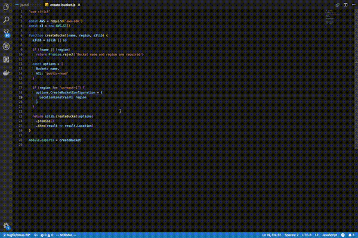

How to debug Javascript
===========================================

## Summary
1. Set config
2. Mark break point
3. Run application

## Set config
Change directory to application root directory.
```
user$ cd application_root/
``` 

Make hidden directory anad configure file for vscode
```
user$ mkdir .vscode
user$ vim .vscode/launch.json
```

Copy below and paste on the configuration
```
{
    "version": "0.2.0",
    "configurations": [
        {
            "name": "Server",
            "type": "node",
            "request": "launch",
            "program": "index.js",
            "stopOnEntry": false,
            "args": [],
            "cwd": ".",
            "runtimeExecutable": null,
            "runtimeArgs": [
                "--nolazy"
            ],
            "env": {
            },
            "externalConsole": false,
            "sourceMaps": false,
            "outDir": null
        }
    ]
}
```

The most important parameters are `program` and `args`.

- program 
    - Debugg target file.
- args
    - Args with debug. 

## Mark break point
Make break points like below gif.



## Run application
Push F5
